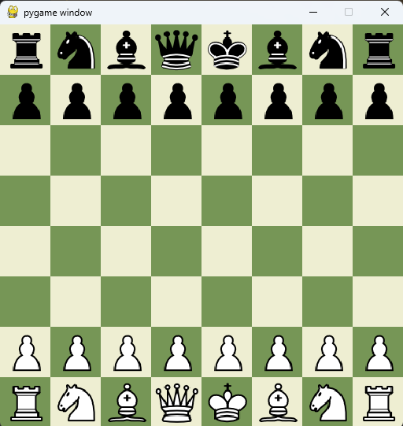

AI Chess
Bem-vindo ao AI Chess, o repositório que traz à vida um projeto final fascinante da disciplina de Inteligência
Artificial! 🌟

Este projeto é uma aplicação prática de conceitos avançados de IA, focando na construção de um jogo de xadrez desafiador
e inteligente. O objetivo principal do AI Chess é demonstrar como técnicas sofisticadas de IA podem ser aplicadas para
criar uma experiência de jogo envolvente e desafiadora.

Principais Componentes:

- Algoritmos de Negamax e Minimax: Implementação dos algoritmos fundamentais para tomada de decisão em jogos de
  estratégia.
- Poda com Negamax: Aperfeiçoamento da eficiência do algoritmo, eliminando jogadas subótimas para otimizar a performance
  do jogo.
- Modelo de Heurística: Desenvolvimento de um sistema de avaliação que melhora a capacidade da IA em prever e reagir às
  jogadas.

A tela inicial do jogo é exibida abaixo:

